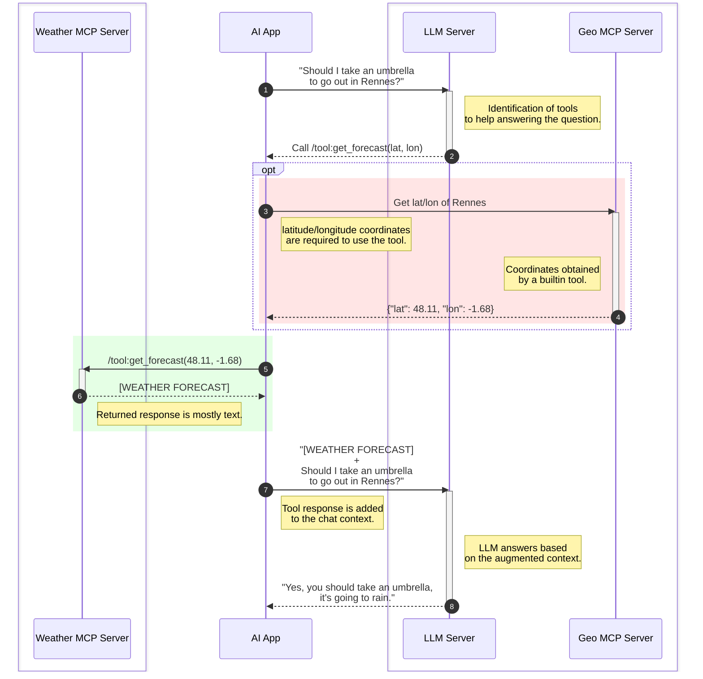

# Model Context Protocol

## Proof Of Concept

A **M**ichel **C**aradec **P**itch 🤡

--

## Agenda

- Concepts
- Weather MCP Server
- Implementation
- Advanced Features
- Points Of Attention

*Repository <https://github.com/michelcaradec/mcp-poc>.*

---

## Concepts

- LLMs for requests on **general** topics.
  - Trained with **public** sources.
- What if we need to extend:
  - Custom (private) **knowledge**?
  - Capabilities (take **actions**)?

--

### RAG vs MCP

LLMs can be **enriched**:

- Something to **KNOW**:
  - **R**etrieval-**A**ugmented **G**eneration.
  - Improve answers.
- Something to **DO**:
  - **M**odel **C**ontext **P**rotocol.
  - Take actions (invoke tools, APIs, databases).

note:
See <https://www.truefoundry.com/blog/mcp-vs-rag>.

--

### About Model Context Protocol

- Introduced by Anthropic in [2024-11](https://www.anthropic.com/news/model-context-protocol).
- Communication protocol between LLM and **external** tools.
  - ≈ OpenAPI between client applications and APIs (but more flexible).
- MCP can be viewed as the **USB-C** of LLMs.

*More on <https://modelcontextprotocol.io/>.*

--

### MCP Server

What is exposed:

- **Tools**: take actions.
- **Prompts**: suggest prompts.
- **Resources** (additional information):
  - Database schema.
  - Extra context.
  - ...

---

## Weather MCP Server

Get weather forecast using the [Weather API Open-Meteo](https://open-meteo.com/).

note:
Here we request a public API, but it could be an internal one.

--

### Demonstration

In [Claude Desktop](https://claude.ai/).

*Can be done in any AI application.*

note:
Start the MCP server with: `uv run ./src/weather/main.py --transport streamable-http`.
Prompts `get_weather_prompt` (tool execution explicitly required), `get_weather_advice_prompt` (tool execution implicitly required, as the LLM needs weather information to answer), `get_where_should_i_go_prompt` (gathering of the favorite cities, and weather retrieval for each).

--

### Usage Workflow

[View in Mermaid Live](https://mermaid.live/view#pako:eNq1VW1v0zAQ_isnf2ETWda0pLQRGqrKgEmbQN2kCQhCTnJNLRK72M5YqfrfOTtd36jgE1HVnK27x889d-csWa4KZAkz-KNBmeMbwUvN61QCPbyxSjZ1hjqV7U6mHlvDPXOurcjFnEsLN-OPwA3cI7cz1H55i_rBRTpXlEVr7MaM5nMXM7py1j_wr69vnK977eIeur1D5dzc6yiF1qTjzi4uCCuBlN3OVFMVcAWWf0fgEihhjVXFX2X6wiooFajGgpAwQSnRvE7ZWp3cigdu0ZFqd6SilRblzIKagse_KlBaMRU5t0JJt22Vqswae4YVSSDNT9RClkDSAZXBONcQWkxCOSOyRDmBMa8qOHcASYn221RpzLmxJxW3AVRKnrYhBe5Ta3fV3D6ZFGZBlxk_6cZxAJ32F0anW1FbiUjHhMS0QCecVy3_VoWt5-Ysct7u7kvh2ROGsE2BDqj0FuRK6UJIivaKcE0x1IhCY0E6QWPQa-IyDg-wK5x6aE9xvMUBlVkuJBYOMFsAh6wRlaXyHaBQ4EbYZcqIXcoSeDEIoyigtiCSbn0Whf3Bahu1o-0m353O2jG3IpO4G52PiEyNmhyr6pqKZ3B6RG-K2-7SYpPNl_vL0d37ywm8_TC5HI9u774e5b8Xv18vT2mCttEkJGVi5kpSLYSBWhlbLcDiow3_Pld_snAVee7-_tvI-fTvSMk9zrwo2nYgaNdO-Yxbaj25k8SRyfU3jh9NAxk3LQKNgEPgTVnTXJM2-zC7w5qyT2gCWKgGTJvvYbaBQxT2maGE_fgr0NS64VO2-3PMAlZqUbDE6gYDVqOuuVuypfNOGfGq0bVsygqc8qayDmdFYXQzflaqforUqilnLJnyytCqmRd0wPra3-xqqirqsWqkZUnUGXgQlizZI0u68SDsdXrdQa8_jF50-t04YAuW9DthHEdR1Iu6g36_G0WrgP3yx3bCwcu4457hMI56cW8YMCyEVfqm_fj4b9DqN-tPDFM)



<!-- https://mermaid.live/edit -->

note:
On the first explanation, bypass the "Get lat/lon of Rennes" step, to only focus on the Weather MCP Server. Then come back to it afterward, as it is also a (builtin) MCP server.

---

## Implementation

Python library [FastMCP](https://gofastmcp.com/):

- **Server** object `mcp`.
- **Decorator** `@mcp`.
  - Discovery by **introspection** (function name, type hints, doc strings, annotations).
- Use of `async` / `await`.
- **Transport**:
  - `stdio` for local test.
  - `streamable-http` for production deployments.

note:
`sse` (Server-Sent Events) is legacy.
In-Memory for unit-tests.

---

## Advanced Features

Context: interface between AI App and MCP Server.

- **Logging**.
- **Progress** reporting.
- **Elicitation** (request input from users during tool execution):
  - By function signature.
  - On request.
- **State** management.
- **Resources/prompts** access.

note:
See <https://gofastmcp.com/servers/context>.
Inspect the tool `get_forecast` for logging and progress reporting (the logs can be seen in the console where the MCP server was started).
Inspect the prompt `get_weather_prompt` for elicitation.

--

### MCP Inspector

Manually **test** an MCP server.

```bash
uv run fastmcp dev ./src/weather/main.py
```

---

## Points Of Attention

- Server **authentication** (not covered here).
- Permission Management: **grant execution** once vs always.
- Prompt injection: commands **hidden** in shared documents.
  - Ex: a downloaded CSV.
- Tool name **typo-squatting**.
- **Token usage** explosion.

note:
See <https://hiddenlayer.com/innovation-hub/mcp-model-context-pitfalls-in-an-agentic-world/>.
Token usage explosion: LLM are stateless, so all the context of the session (previous questions, list of MCP tools) is sent with every request, to be reprocessed. The token usage will grow exponentially with the duration of the session, until it reaches the context window limit.
See <https://www.ibm.com/think/topics/context-window> and <https://guptadeepak.com/complete-guide-to-ai-tokens-understanding-optimization-and-cost-management/>.

---

## One More Thing

- Growing offer of third-party remote servers.
  - See <https://github.com/modelcontextprotocol/servers>.
- OVH MCP Server:
  - <https://labs.ovhcloud.com/en/mcp-server/>.

And many more to imagine! 🤓

note:
To be tested with Gemini CLI.

<!--
```json
{
    "mcpServers": {
        "ovh": {
            "command": "npx",
            "args": [
                "mcp-remote",
                "https://mcp.eu.ovhcloud.com/mcp"
            ]
        }
    }
}
```
-->

---

## Questions & Answers

Thank you!

😄
